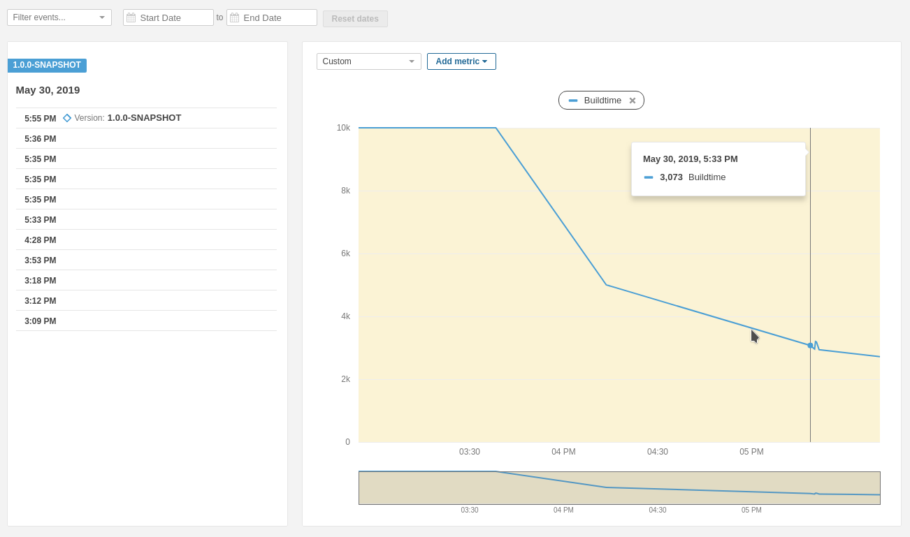

# Maven Profiler Extension Report Integration for SonarQube

Maven profiler extension (https://github.com/jcgay/maven-profiler) creates a nice report file. 
It would be great to have some data integrated into the SonarQube report to track e.g. buildtimes over time.
This makes slow builds visible and optimizations as well :)

## State

This is a first working proof of concept. There is no configuration or customization right now avaliable. 
The report file generated by the maven extension has to be in a fixed place. The metric Sonarqube gets is 
the **total build time** and only that. 

Tested on SonarQube 7.7.

## Usage

* Build package and install it as plugin to SonarQube
* Integrate the maven profiler extension as described here: https://github.com/jcgay/maven-profiler
* Ensure that the report file is generated as JSON, directly into the /target folder
```
mvn clean package -Dprofile -DprofileFormat=JSON
```
* Run Sonarqube analysis:
```
mvn sonar:sonar
```

If everything worked fine you will find a new measure "Buildtime" in the category "Maven-Profiler" 
in your SonarQube project. The history graph will show you how the build times change over time:


